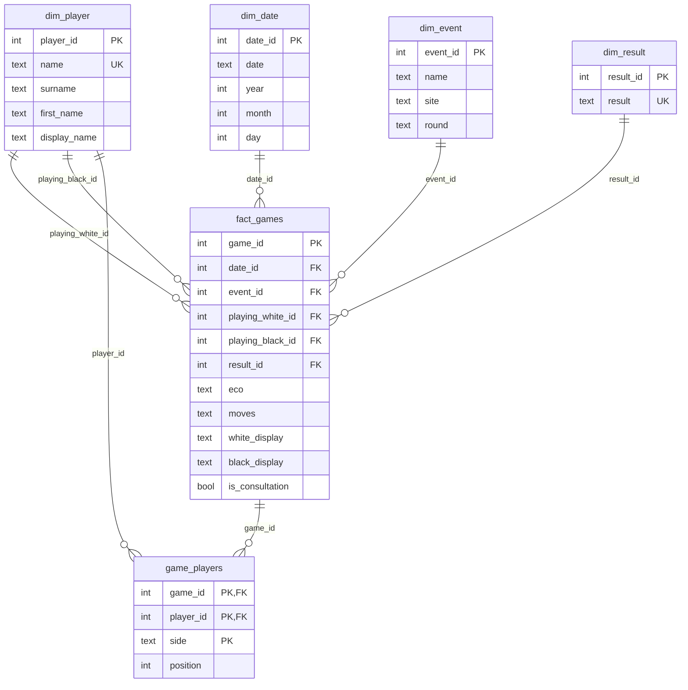

```mermaid
erDiagram
    dim_player {
        int player_id PK
        text name UK
        text surname
        text first_name
        text display_name
    }

    dim_date {
        int date_id PK
        text date
        int year
        int month
        int day
    }

    dim_event {
        int event_id PK
        text name
        text site
        text round
    }

    dim_result {
        int result_id PK
        text result UK
    }

    fact_games {
        int game_id PK
        int date_id FK
        int event_id FK
        int playing_white_id FK
        int playing_black_id FK
        int result_id FK
        text eco
        text moves
        text white_display
        text black_display
        bool is_consultation
    }

    game_players {
        int game_id PK,FK
        int player_id PK,FK
        text side PK
        int position
    }

    dim_player ||--o{ fact_games : "playing_white_id"
    dim_player ||--o{ fact_games : "playing_black_id"
    dim_date ||--o{ fact_games : "date_id"
    dim_event ||--o{ fact_games : "event_id"
    dim_result ||--o{ fact_games : "result_id"
    fact_games ||--o{ game_players : "game_id"
    dim_player ||--o{ game_players : "player_id"
```
